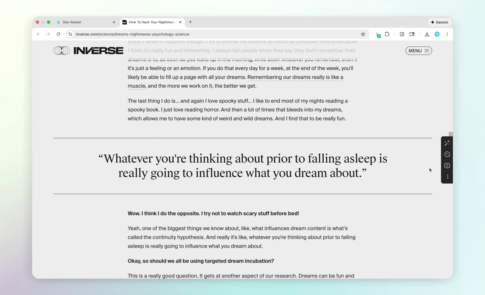

+++
date = '2026-01-15'
title = 'Slax Reader: A Smarter, More Efficient, AI-Powered Way to Save & Read Forever'
description = "Stop just saving links; start knowing what you read. From our mission to every feature, see how Slax helps deep readers deconstruct articles and secure them forever with free snapshots"
+++

Hi, we've just launched **Slax Reader** into public beta: **[the permanent, open-source library](https://r.slax.com) that saves, understands, and connects your reading**.

It’s a reliable, quiet space for thoughtful reading. [Get started with Slax Reader Pro for 1 months free NOW](https://r.slax.com/download)

## Why did we build this？
If you’re a knowledge worker or a heavy information consumer, you probably know the "digital hoarder" anxiety.  We’ve been there as well. We read a lot, save even more, but:

- **The 404 Heartbreak**: Wanna go back to find an insightful article? But it’s a 404.
- **Subscriptions are pricey**: Readwise Reader is great, but the monthly cost adds up.
- **Tools come and go**: We’ve seen Pocket shut down, Omnivore fade away… Urgently needed a self-hosted open source alternative.
- **Information overload**: A mountain of articles pile up. But you have no time to actually read them, and half the time when you do open one, it’s not even worth it.

We’ve been "read-it-later" junkies for almost 20 years.—and none of them we found it really felt right. That’s why we started Slax Reader.

---
## What is Slax Reader？
In short: **Save Forever. Read Smarter. Connect Deeper**.

Just one click to save, instant AI to summarize & navigate, highlighting to think, and also annotated sharing to learn with others. All the things in one place — [Slax Reader](https://r.slax.com).

---
## Save Forever, Read Anywhere, Anytime with Slax Reader, for Free — Our Gift to Early Users

We want everyone to enjoy reading without worrying about any limits. So these core features are completely free: [Check our full features list here](https://r.slax.com/#features).
1. **Unlimited Bookmarks**: Found something cool? One click to save and read it anytime, anywhere, even offline. Put the whole internet in your Slax Reader if you want. No more scattered links across X, emails, or random webpage.
2. **Permanent Snapshots (Anti-404)**: This is the big one. Even on the free tier, we take a permanent snapshot of your saves and have no storage limits. No more worrying about any insightful content disappearing.
3. **The "Zero Friction" Reading Experience**:
    - Original Web Highlighting: Highlight and comment not only on the snapshot, but also directly on the original website. Your highlights and notes sync bidirectionally, overlaid both on the snapshot and the website. For the snapshot, we also optimized the formatting for text, images, and even audio, so it feels clean and great across any device. 
    - Tag Stay Organized: Manual tagging, starring, and archiving are all free. You can keep things tidy on Slax Reader without paying. 
    - Full-Text Search: Find that one specific quote  in seconds from thousands of article collections. 
4. **Social Reading**: Reading doesn't have to be always lonely. Share articles with your insights to your friends, see what other Slax Reader users are highlighting, and join discussions. We think it’s a great feature for both team collaboration and inspring from others. 
5. **Seamless Sync**: We have Web, Chrome, iOS and Android versions to keep your readings in sync. You can always start reading on your desktop, finish on your phone while you're out. 

---
## Innovations We’re Most Proud of So Far ([1 months FREE Pro Trial](https://r.slax.com/download))

Slax Reader is more than a bookmark manager and normal read-it-later tools; It's an **AI-powered personal reading assistant designed** to pull you out of the "saved but never read" article pile to read smarter and understand deeper. [Explore how our AI works](https://r.slax.com/#how-it-works).

**As a welcome gift, early users get 1 months of Slax Reader Pro for free**.
1. **AI Auto-Tagging**: Slax Reader AI analyzes your articles and automatically assigns relevant tags—keeping your library tidy without any manual effort. **Here is the important part: it only picks from your existing tags**. We won’t overstep by inventing new, random categories that clutter your library; we respect the system you’ve worked hard to create. As long-time power users, we know manual tagging is a chore. All it takes is one lazy afternoon to let the pile grow until your entire organization system collapses. Hope auto-tagging can finally liberate you from that burden. 
2. **Instant Summaries**: Get the gist in seconds. Decide instantly: "Is this worth 20 minutes of my life, or is this one-line summary enough?" 
3. **Navigational Article Outlines**: Ever feel lost in a 5,000-word essay? Jump straight to sections you care about using an **AI-generated mind-map/outline**. Honestly, this is one of my favorite features. It cuts through the fluff and has significantly leveled up my reading efficiency. 
4. **Chat with Your Articles**: Stuck on a technical term? Just ask the **AI Chatbot** with any confusing terms, sentences, or the whole piece. Want to brainstorm based on the article? Treat the AI Chatbot like a study buddy right inside the article.  

---
## Built for the Modern Web & Local Control
As an **open-source product**, we care about your data ownership.
- **Easy Migration**: One-click import from Pocket or Omnivore.
- **You own your data**: Slax Reader is fully open source. Everything’s transparent on [GitHub](https://github.com/slax-lab/slax-reader).
- **Universal Platform Support**: Slax Reader is optimized for the modern, fragmented web. Whether it’s a website, standard blog post, or content from complex platforms like WeChat Official Accounts—no broken images, no messy formatting.

---
## Our Commitment
We are still early, but we are building this for the long haul. For Slax Reader, we still have so much to build. Hope Slax Reader to be a tool that helps you actually *understand* what you read, not just bookmark it for a "later" that never comes.

One more thing we’re proud to say: Slax Reader is built on a lean, sustainable foundation with very low operational costs. Our team that has **stably operated a mature product for over a decade**, so we know what it takes to build tools that last. Since we use Slax Reader ourselves every single day, so we‘ll keep polishing it—and we certainly aren't going anywhere.

**Special Offer**:  
To say thanks to our early community, here is our special offer: [1 months of Slax Reader Pro for free](https://r.slax.com/download).

**We'd Love Your Help!**  
Since we’ve just launched, we’d eager to your feedback：
- Feedback on features (Do you find it useful? What’s missing?)
- Contributions to code, docs.

**X**：[https://x.com/SlaxReader](https://x.com/SlaxReader)  
**Telegram**：[https://t.me/slax_app](https://t.me/slax_app)

Thank you for joining us on this journey. Hope you enjoy this reading journey!

**The Slax Reader Team**
